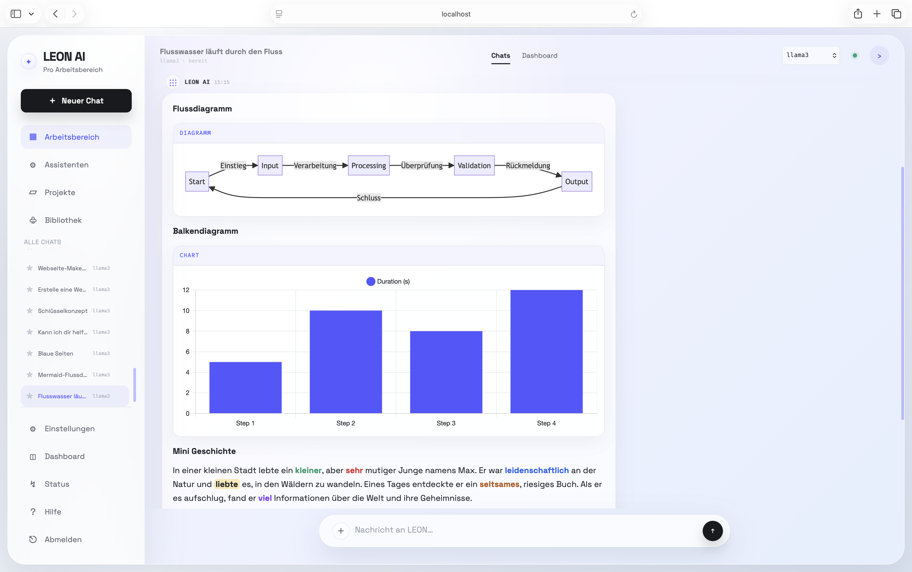
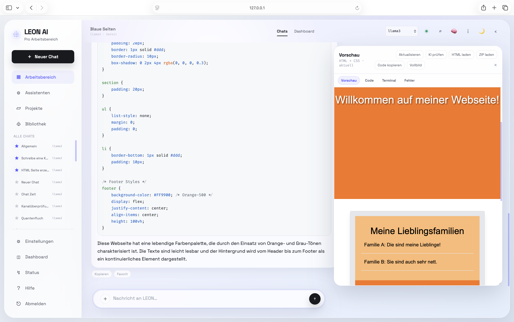
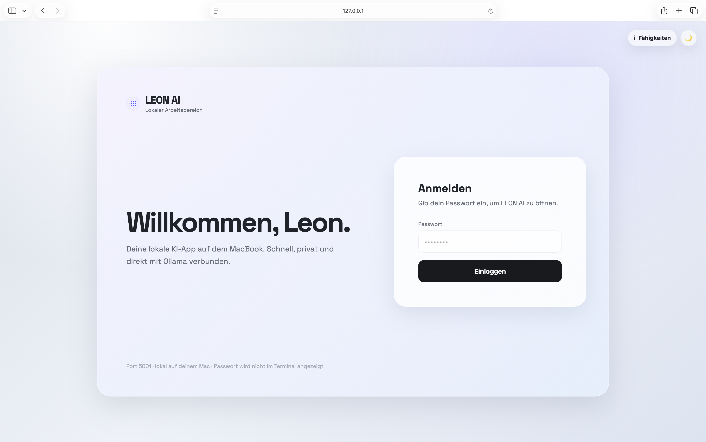
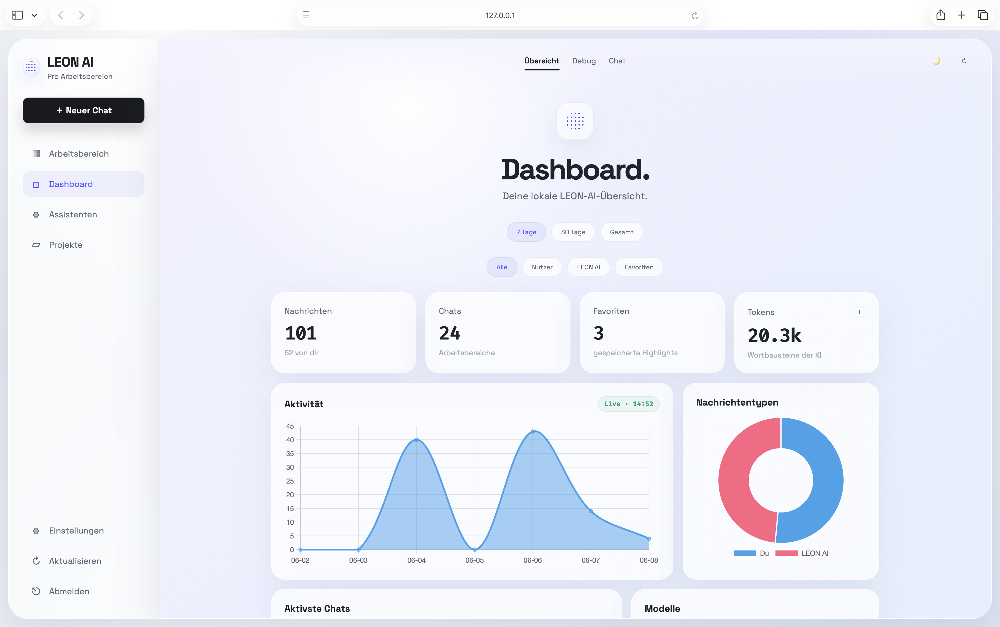

# LEON AI


> English is the main documentation language for this repository. German documentation will be maintained separately in [LeonAI-DE](https://github.com/LeonTOfficial/LeonAI-DE).



**Chat workspace preview:** LEON AI combines local AI conversations, code output, rendered artifacts, and project context in one workspace.

## What Is LEON AI?

LEON AI is a private, local AI workspace for your own computer. It brings chat, code, live previews, diagrams, Python experiments, memory, logs, and dashboards into one clean place. It is built for macOS, Windows, and Linux with a focus on privacy, security, and German-language support.

## Features That Make You Want To Try It

- **Local AI models:** Run with Ollama and use models such as `llama3`, `llama3.2:1b`, LLaVA, and more.
- **Smart chat workspace:** Auto titles, pinned chats, branching, favorites, memory, export, and German-first answers.
- **Colored text in chat:** Ask LEON AI to mark nouns red, highlight key ideas, or color-code feedback with safe color tags.
- **Native diagrams and charts:** Mermaid diagrams and Chart.js graphs render directly inside the chat instead of staying as raw code.
- **Super Artifacts:** Generate HTML, CSS, JavaScript, Tailwind layouts, and Python snippets with a live preview panel.
- **Browser Python sandbox:** Python can run inside the browser through Pyodide, isolated from your operating system.
- **Vision image uploads:** Upload images and ask LEON AI to describe, analyze, or reason about them when a vision model is installed.
- **Privacy dashboard:** See activity, token usage, health checks, backups, logs, and privacy tools in one dashboard.
- **First setup:** On a fresh install, choose your own password and first name before using the app.



**Artifacts preview:** Generated HTML, CSS, JavaScript, and Tailwind-style layouts can be checked directly beside the chat.


## Download / Clone And Install

LEON AI is a cross-platform Flask application. macOS includes a convenience launcher, while Windows laptops/desktops and Linux systems run the same project through Python and Ollama.

1. Install [Ollama](https://ollama.com/) and pull the recommended models:

```bash
ollama pull llama3
ollama pull llama3.2:1b
```

2. Download the project with Git and enter the folder:

```bash
git clone https://github.com/LeonTOfficial/LeonAI.git
cd LeonAI
```

3. Create your local settings file:

```bash
cp .env.example .env
```

4. Open `.env` and adjust the basics:

```env
LEON_PASSWORD=change-this-before-sharing
SECRET_KEY=use-a-long-random-secret
PORT=5001
HOST=127.0.0.1
OLLAMA_MODEL=llama3
```

5. Start LEON AI on your platform:

### macOS

```bash
chmod +x Starten.command
./Starten.command
```

If macOS refuses to run the command file for security reasons, open Terminal in the project folder and run:

```bash
chmod +x Starten.command
./Starten.command
```

### Windows PowerShell

```powershell
py -m venv venv
.\venv\Scripts\Activate.ps1
python -m pip install --upgrade pip
pip install -r requirements.txt
python app.py
```

If PowerShell blocks the virtual environment activation script, run PowerShell as your user and allow scripts for the current session:

```powershell
Set-ExecutionPolicy -Scope Process -ExecutionPolicy Bypass
.\venv\Scripts\Activate.ps1
```

### Linux

```bash
python3 -m venv venv
source venv/bin/activate
python -m pip install --upgrade pip
pip install -r requirements.txt
python app.py
```

6. Open the app in your browser:

```text
http://127.0.0.1:5001
```

On a fresh install, LEON AI shows a first-setup screen where you choose your own password and first name. After that, the normal login is used.

Before publishing changes, you can run the local release doctor:

```bash
python scripts/leon_doctor.py
```

For a fuller local check, run it together with the test suite:

```bash
python scripts/leon_doctor.py --run-tests
```



**Login and first setup:** On first launch, LEON AI asks for a first name and password before opening the local workspace.

## Storage Needed

| Component | Approx. size |
| --- | ---: |
| LEON AI code + Python dependencies | about 0.5 - 1.5 GB |
| Llama 3 model | about 4.7 GB |
| Llama 3.2 1B model | about 1.3 GB |
| Total recommended space | about 6.5 - 7.5 GB |

## For The Nerds

Want to know how the security model works, how the SQLite schema is structured, or how the v4 modular architecture is organized?

Read:

- [`STRUKTUR.md`](STRUKTUR.md) for the architecture, modules, routes, services, and frontend structure.
- [`SECURITY.md`](SECURITY.md) for the local security model, `.env` guidance, dependency notes, and vulnerability reporting.
- [`TESTING.md`](TESTING.md) for the current unit-test and QA workflow.
- [`CONTRIBUTING.md`](CONTRIBUTING.md) for contribution guidelines and how to report bugs or suggest features.
- [`CHANGELOG.md`](CHANGELOG.md) for public release notes and version history.



**Dashboard preview:** Monitor privacy information, token usage, logs, system health, and project activity from the built-in dashboard.

## Verified Engineering Highlights

LEON AI is not just a visual demo. The project includes a focused test suite and a documented security model.

- **Tested backend flows:** login, setup, room creation, branching, artifact history, backups, privacy actions, and error handling.
- **Tested frontend contracts:** CSRF headers, colored chat tags, Mermaid/Chart.js integration markers, Pyodide wiring, and artifact preview controls.
- **CI checks:** GitHub Actions in `.github/workflows/test.yml` run the test suite on Python 3.11 and 3.12 and check the main JavaScript modules.
- **Release doctor:** `scripts/leon_doctor.py` checks public docs, required files, CI wiring, and accidental runtime-data tracking before publishing.
- **Security evidence:** CSRF protection lives in `utils/security.py`, request/security headers in `routes/middleware.py`, error shielding in `utils/errors.py`, and the `.gitignore` excludes local runtime data and secrets.
- **Current QA command:** `./venv/bin/python -m unittest discover -s tests -q`

Real folder overview:

```text
LeonAI/
├── app.py
├── config.py
├── Starten.command
├── README.md
├── SECURITY.md
├── STRUKTUR.md
├── TESTING.md
├── CHANGELOG.md
├── LICENSE
├── CONTRIBUTING.md
├── .github/
│   └── workflows/
│       └── test.yml
├── scripts/
│   └── leon_doctor.py
├── models/
│   └── database.py
├── routes/
│   ├── api.py
│   ├── auth.py
│   ├── chat.py
│   ├── middleware.py
│   └── pages.py
├── services/
│   ├── artifact_service.py
│   ├── backup_service.py
│   ├── chat_service.py
│   ├── memory_service.py
│   ├── ollama_service.py
│   ├── profile_service.py
│   └── room_service.py
├── static/
│   └── js/
│       ├── api.js
│       ├── artifacts.js
│       ├── chat.js
│       └── ui.js
├── templates/
│   ├── dashboard.html
│   └── index.html
├── tests/
│   ├── test_core.py
│   └── test_ui_flows.py
└── docs/
    └── screenshots/
```

## About The Developer

I am **Leon**, 16 years old, born in 2009, from Germany, and preparing for a future in business informatics. LEON AI is my personal learning project for understanding how modern full-stack software works: modular architecture, secure authentication, local data, testing, and real-world deployment.

This project was built with **AI-Assisted Development**. That matters: it shows how a young developer can use AI as a serious engineering partner to build modular, secure, and usable software fast. The code quality, test coverage, and documentation reflect this partnership.

A special highlight: I received the **Landespreis Medienbildung** for creating educational content that makes AI easier to understand: what machine learning is at a high level, what is behind systems like ChatGPT, and how to use AI tools responsibly.

## License & Support

**LEON AI is proprietary source-available software.** All rights are reserved by the author: **Copyright © 2026 Leon**.

| Use case | Permission required? | Notes |
| --- | --- | --- |
| Use the official app/demo privately | **No** | Anyone may use the official app/demo normally and free of charge for private use. |
| Read the source code for learning or review | **No** | The repository may be viewed for educational, evaluation, and review purposes. |
| Copy, modify, self-host, redistribute, rebrand, or publish the source code | **Yes** | Prior written permission from Leon is required. |
| Commercial use or integration into another product/service | **Yes** | A separate written permission/license is required. |

LEON AI is designed as a portable local AI workspace for macOS, Windows laptops/desktops, and Linux systems when Python, the required dependencies, and Ollama are available on that machine.

Community feedback is very welcome: please test the app actively, try real workflows, and open a GitHub Issue whenever you find a bug, have a question, or want to suggest an improvement. For security findings, please see [`SECURITY.md`](SECURITY.md) for responsible disclosure.

If you like this project, leave a **star ⭐️** and **follow** me on GitHub. It supports my learning path and helps me keep building better, safer, and more useful AI projects.
