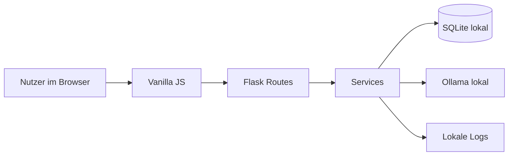

# Struktur von LEON AI


## Grundidee

LEON AI ist in klare Bereiche aufgeteilt. Das Backend besteht aus Routen, Services, Modellen und Hilfsfunktionen. Das Frontend besteht aus kleinen JavaScript-Modulen. SQLite speichert lokale Daten. Ollama liefert lokale KI-Antworten.

## Ordnerübersicht

```text
LeonAI/
├── app.py                     # Flask-Startpunkt
├── config.py                  # zentrale Konfiguration
├── Starten.command            # macOS-Starter
├── Starten.ps1                # Windows-Starter
├── start.sh                   # Linux/macOS-Shell-Starter
├── package.json               # Node/Playwright-Werkzeuge
├── playwright.config.js       # Browser-QA-Konfiguration
├── README.md                  # englische Hauptdoku
├── SECURITY.md                # englische Sicherheitsdoku
├── TESTING.md                 # englische Testdoku
├── STRUKTUR.md                # Architekturübersicht
├── CHANGELOG.md               # öffentliche Änderungshistorie
├── ROADMAP.md                 # Roadmap und Feedback-Wünsche
├── CONTRIBUTING.md            # Regeln für Feedback und Beiträge
├── .github/                   # CI, Issues und PR-Vorlagen
├── scripts/                   # Release Doctor und Hilfsskripte
├── models/                    # SQLite-Verbindung und Migrationen
├── routes/                    # Flask-Routen
├── services/                  # Fachlogik
├── static/js/                 # Frontend-Module
├── templates/                 # HTML-Oberflächen
├── tests/                     # Python- und Browser-Tests
├── utils/                     # Sicherheit, Logs, Privacy, Fehler
├── data/                      # lokale Runtime-Daten, nicht in Git
├── backup/                    # lokale Backups, nicht in Git
└── venv/                      # lokale Python-Umgebung, nicht in Git
```

## Backend-Schichten

| Schicht | Ordner | Aufgabe |
| --- | --- | --- |
| Routes | `routes/` | Nimmt HTTP-Anfragen entgegen und liefert Seiten, JSON oder Streams. |
| Services | `services/` | Enthält die eigentliche App-Logik. |
| Models | `models/` | Datenbank, Schema und Migrationen. |
| Utils | `utils/` | Wiederverwendbare Helfer für Sicherheit, Logs, Privacy und Fehler. |

## Wichtige Routen

| Datei | Aufgabe |
| --- | --- |
| `routes/auth.py` | Login, Logout und First Setup. |
| `routes/pages.py` | Chat-Seite, Dashboard und PWA-Dateien. |
| `routes/api.py` | JSON-API für Räume, Stats, Privacy, Backups und Artifacts. |
| `routes/chat.py` | Streaming-Chat, Modelle, Vision und Ollama. |
| `routes/middleware.py` | Security Header, CSRF/Origin und Request-IDs. |

## Wichtige Services

| Datei | Aufgabe |
| --- | --- |
| `artifact_service.py` | Speichert und verwaltet Artefakt-Versionen. |
| `backup_service.py` | Erstellt, prüft und stellt SQLite-Backups wieder her. |
| `chat_service.py` | Baut Chat-Kontext, Branching und Auto-Titel. |
| `memory_service.py` | Verwaltet gespeicherte Erinnerungen. |
| `ollama_service.py` | Kommuniziert mit lokalen Ollama-Modellen. |
| `profile_service.py` | Speichert First-Setup-Profil und Passwort-Hash. |
| `room_service.py` | Verwaltet Chat-Räume, Pinning und leere Chats. |

## Frontend-Module

| Datei | Aufgabe |
| --- | --- |
| `api.js` | Gemeinsamer State, Fetch-Helfer und CSRF-Header. |
| `chat.js` | Nachrichten, Streaming, Markdown, Farbtags, Mermaid und Charts. |
| `artifacts.js` | Live-Vorschau, iFrame, Pyodide, Terminal und Fehleranzeige. |
| `ui.js` | Sidebar, Modals, Theme, Einstellungen und Status. |

## Datenfluss



## Logs und Fehler

Fehler werden nicht roh an den Browser weitergegeben. Der Browser bekommt eine kurze Meldung und eine Request-ID. Die technischen Details bleiben lokal in `data/logs/leon.log`.

| Element | Bedeutung |
| --- | --- |
| Request-ID | Verbindet Browsermeldung mit Logeintrag. |
| `data/logs/leon.log` | Lokale technische Details. |
| Debug Center | Zeigt Logs und Fehler in der App an. |
| Release Doctor | Prüft vor Releases Doku, Pflichtdateien und Git-Sicherheit. |
